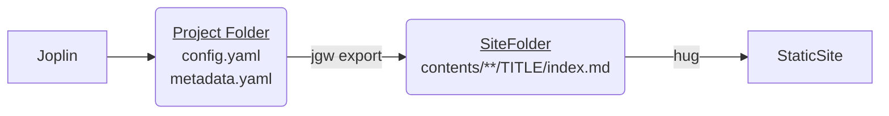

Joplin Garden Worker is a tool to export notes from Joplin to build a digital garden website. Unlike the traditional personal blog that publishes a set of articles in a reversed chronological order, the digital garden is a lot like a wiki with evolving ideas connected by links.

This tool support exporting to a Github Wiki or Hugo Static Site Generator.

Demo sites:
- Hugo: [Unlimited Build Works](https://benlau.github.io/)
- Github Wiki: [benlau.github.io Wiki](https://github.com/benlau/benlau.github.io/wiki)

## Features
- Exported tag filtered notes from Joplin
- Export to Hugo / Github Wiki
- Support link transclusion
- Support running custom post processing scripts
	- e.g show backlinks on a note

## Use-cases
1. Build digital garden
2. Build a website of books 
3. Update the markdown document inside a software project

# Installation

```bash
git clone https://github.com/benlau/joplin-garden-worker.git
cd joplin-garden-worker
npm install -g
```

That will install `jgw` command line program on your machine.

# Getting Started By a Sample Project

To create your digital garden, you need to choose the engine used. Currently, two kinds of engines are supported: GitHub Wiki / Hugo.

And then create a `config.yaml` to store your perferences. You may provides a `hooks.js` to run script during the generation process to customize the behaviour.

A sample config for building a Hugo website is available at `samples/hugo`. You need to install the hugo command line tool first. 

[Install Hugo | Hugo](https://gohugo.io/getting-started/installing/)

Preparation:

```bash
cd samples/hugo/beautiful
git clone https://github.com/halogenica/beautifulhugo.git themes/beautifulhugo
```

The Usage:

## Obtain the API key

To access your Data in Joplin, you need to get the API KEY. You may run the following commands:

```bash
$ cd samples/hugo/beautiful
$ jgw auth 
```

And then you should launch Joplin and it will show a dialog to ask to grant permission for the request if you have web clipper enabled. ([Joplin Web Clipper | Joplin](https://joplinapp.org/clipper/)). Accept the request then it will write a `.auth` file to store the API . If you holding the project inside a version control system like git. Please don't commit this file.

## Export the site

```bash
$ cd samples/hugo/beautiful
$ jgw export site
1 notes exported
0 resources exported
```

Run the above command to export the site to hugo. If it is showing `0 notes exported`, it is alright because you may not have any notes with the tag "jgw-demo". Open the Joplin , and random tag a note you would like to export. Then rerun the above command.

```
$ cd samples/hugo/beautiful/site
hugo server -w
```

Open the http://localhost:1313 in your browser. It should show a digital garden with notes exported from your Joplin. 

## Advanced Usage

TBD
- How to filter private comment
- Set slug 
- Export feature image

The document is incomplete. In case you need a feature not mentioned in this README. Please feel free to ask via the Github Issues.

# Configuration

The Joplin Garden Worker supports exporting a site and customizing the generation process. It needs to hold the configuration and script inside a project folder.

The flow (Hugo):



Each project should contain at least 3 files:

## config.yaml

Example:

```yaml
engine: hugo
hugoOptions:
  outputAsFolder: true
defaultFolder: garden
stripHtmlComments: true
includeTags:
 - jgw
```

- engine: The type of engine used. Available choices: githubwiki/hugo
- inclucedTags: It is an array of tags. Only the note with the tags will be exported.
- hugoOptions: Hugo specific options. 
	- outputAsFolder: A option for Hugo only. By default, the garden worker generates a note in the format of `${folder}/${note-title}.md`. If outputAsFolder was set, it will become `${folder}/${note-title}/index.md`. It is designed to support Hugo theme that will show the featured image. The default value is true.
- defaultFolder: The default output folder of a note. 
- stripHtmlComments: If it is true , HTML comment blocks are removed from the exported note.
 
## metadata.yaml

This file contains the exported notes metadata. For example, garden worker generate the URL of an exported note according to the title. To perverse the URL to be changed by the title modification, garden worker stores the URL into this file. 

## hooks.js

You may customize the generation process by writing your own script inside hooks.js

Example Usage:

- Set tags of the exported note
- Re-render the content (e.g remove private note)
- Append a footer to a specific note with a specific tag

[[ Link to Example]]

# Commands

## Obtain the Joplin API Key

```bash
jgw auth
```

## Update the metadata.yaml

The `metadata.yaml` stores the metadata of the exported notes. Sometimes you may not want to export the notes directly and only updates the metadata.yaml to have a preview of changes. You may run this command:

```bash
jgw update
```

## Exporting the site

This command exports the notes to the target folder and it will also update the metadata.yaml

```bash
jgw export OUTPUT_FOLDER
```
